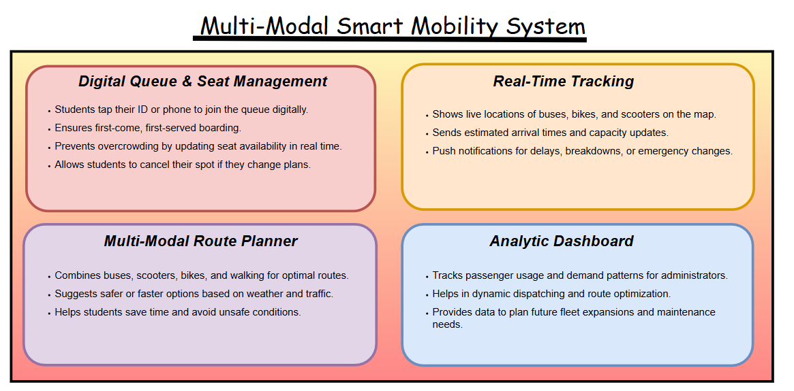
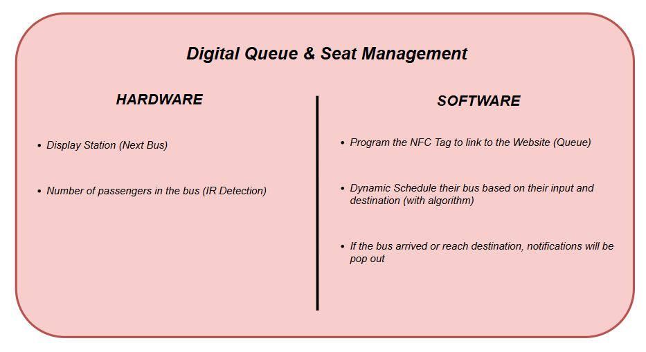
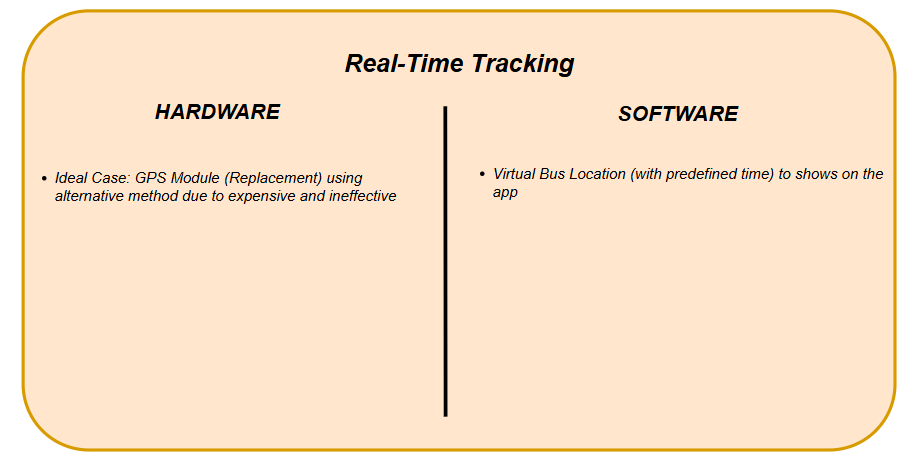
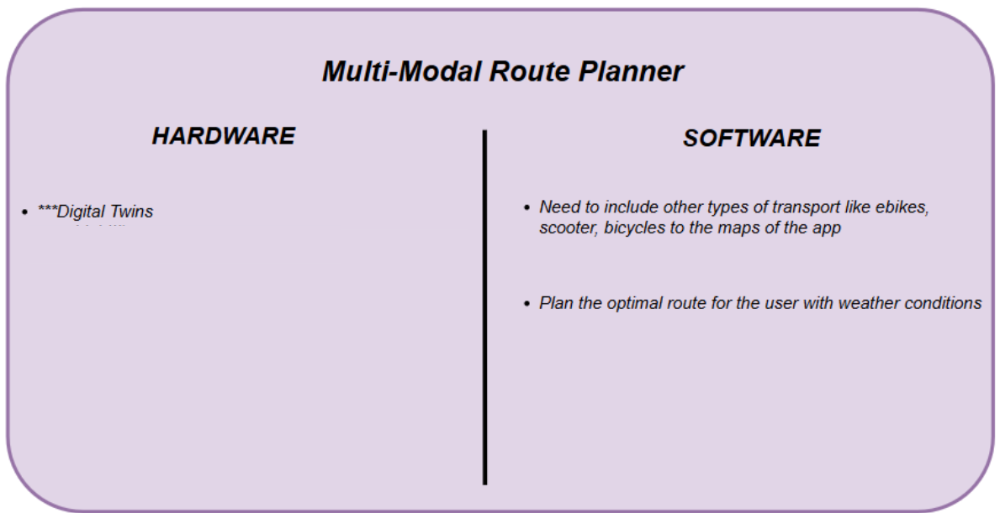
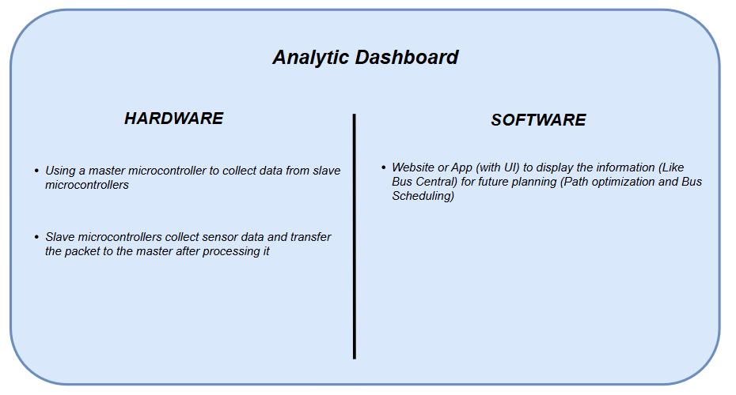
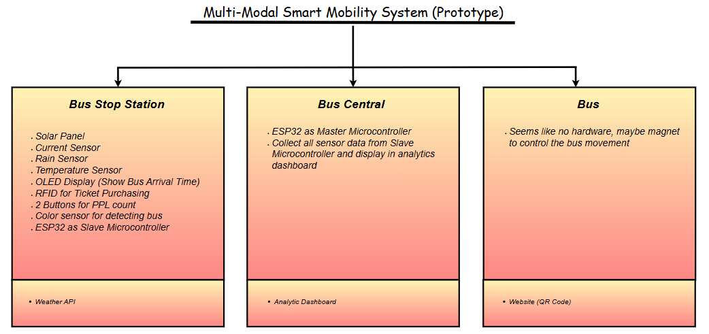
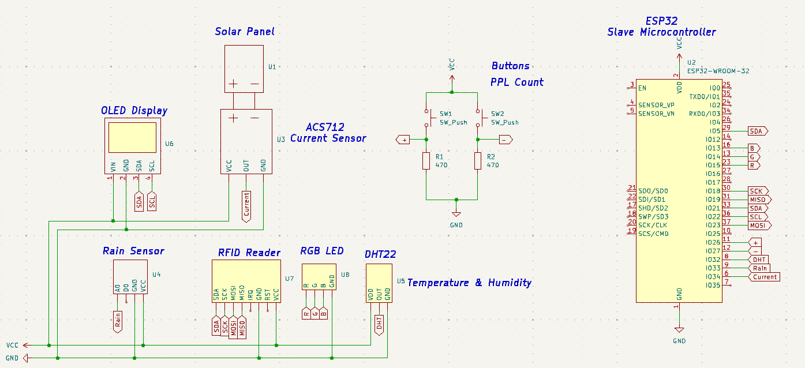

# 🚍 UniMove: Smart Campus Enhancement

UniMove is a **Smart Campus Mobility System** designed to reduce waiting times, optimize campus transport, and provide a seamless travel experience for students and staff.  
It combines **IoT sensors, RFID, GPS, weather awareness, and AI-driven demand prediction** into a unified platform for smarter, faster, and greener campus travel.

---

## ✨ Features

- ✅ **Digital Queue & Seat Management** – Tap ID card/phone to join queues virtually.  
- ✅ **Real-Time Tracking** – GPS-enabled buses, scooters, and bikes.  
- ✅ **Multi-Modal Route Planner** – Combines buses, bikes, scooters, and walking.  
- ✅ **Admin Dashboard** – Provides analytics for fleet management.  
- ✅ **IoT Hardware Integration** – RFID, DHT22 (temp/humidity), rain sensor, ACS712 current sensor, OLED display.  

## 🛠️ Hardware Planning

### 📐 Figma Prototype  
👉 [View our Figma Design](https://www.figma.com/design/UNlKLkwWBsBDO5oIMZejqC/Smart-Campus-Enhancement?node-id=247-555&t=gj1G1HxMJkExqzMx-1)  

### 🎥 Project Video  
👉 [Watch the Project Video](https://youtu.be/8Ld1B0URSZ8)  
